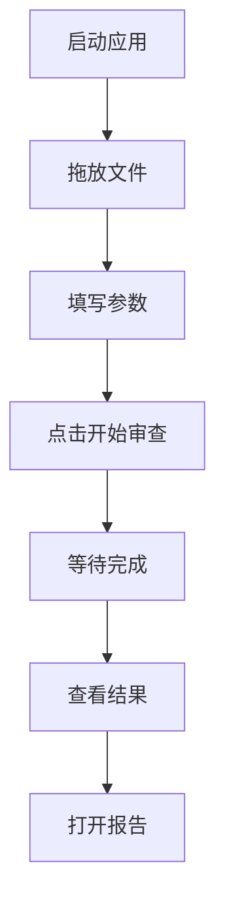
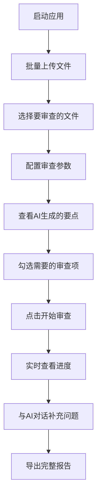

# 📊 界面版本对比

## ASCII 界面预览

### 简洁版 (Classic Layout)

```
╔══════════════════════════════════════════════════════════════╗
║                    📄 合同审查小助手                         ║
╠══════════════════════════════════════════════════════════════╣
║                                                              ║
║  ┌──────────────────────────────────────────────────────┐  ║
║  │  1. 选择合同文件                                       │  ║
║  │  ┌────────────────────────────────────────────────┐  │  ║
║  │  │         拖放合同文件到此处                      │  │  ║
║  │  │     支持 .docx 和 .pdf 格式                     │  │  ║
║  │  └────────────────────────────────────────────────┘  │  ║
║  │  ✅ 软件开发合同.docx                    [浏览文件]  │  ║
║  └──────────────────────────────────────────────────────┘  ║
║                                                              ║
║  ┌──────────────────────────────────────────────────────┐  ║
║  │  2. 设置审查参数                                       │  ║
║  │  客户身份: [乙方 ▼]                                   │  ║
║  │  合同类型: [_______________________________]          │  ║
║  │  关注点:   [_______________________________]          │  ║
║  │  输出格式: [Word (.docx) ▼]                           │  ║
║  └──────────────────────────────────────────────────────┘  ║
║                                                              ║
║          ┌─────────────────────────────────────┐            ║
║          │        🚀 开始审查                   │            ║
║          └─────────────────────────────────────┘            ║
║                                                              ║
║  进度: [████████████░░░░] 60%                               ║
║                                                              ║
║  ┌──────────────────────────────────────────────────────┐  ║
║  │  3. 审查结果                                           │  ║
║  │  ┌────────────────────────────────────────────────┐  │  ║
║  │  │  ### 一、核心风险提示                            │  │  ║
║  │  │  #### 风险点1: 付款周期过长                      │  │  ║
║  │  │  - **条款引用**: 第三条第2款                     │  │  ║
║  │  │  - **风险分析**: ...                              │  │  ║
║  │  │                                                  │  │  ║
║  │  └────────────────────────────────────────────────┘  │  ║
║  │  [📂 打开报告] [📁 打开文件夹] [🗑️ 清空结果]        │  ║
║  └──────────────────────────────────────────────────────┘  ║
║                                                              ║
║  状态: 就绪                                                  ║
╚══════════════════════════════════════════════════════════════╝
```

---

### 专业版 (Professional Layout)

```
╔═════════════════╦═════════════════════════╦═════════════════════════════╗
║   左侧导航栏     ║     中间配置区           ║      右侧AI交互区          ║
║   (280px)       ║     (灵活宽度)           ║       (灵活宽度)           ║
╠═════════════════╬═════════════════════════╬═════════════════════════════╣
║                 ║                         ║                           ║
║  📂 文件管理    ║  🎯 审查配置            ║  🤖 AI律师审查意见        ║
║  ┌──────────┐  ║  ┌────────────────────┐║  ┌───────────────────────┐ ║
║  │+批量上传 │  ║  │ 👤 我方身份: [乙方▼]│║  │ ### 一、核心风险提示   │ ║
║  └──────────┘  ║  │ 📋 合同类型: [____]│║  │                       │ ║
║                 ║  │ 💡 核心关注: [____]│║  │ #### 风险点1: 付款...  │ ║
║  📄 文件列表    ║  └────────────────────┘║  │ - **条款**: 第三条第2款│ ║
║  ┌──────────┐  ║                         ║  │ - **分析**: 约定验收.. │ ║
║  │✅合同A.doc│  ║  📋 审查要点清单        ║  │                       │ ║
║  │🔄合同B.pdf│  ║  ┌──────────────────┐  ║  │ ### 二、修改方案对比   │ ║
║  │⏳合同C.doc│  ║  │ ☑ 付款周期审查    │  ║  │ | 原条款 | 风险说明..│ ║
║  │   ...     │  ║  │ ☑ 知识产权归属    │  ║  │ |--------|----------│ ║
║  └──────────┘  ║  │ ☑ 违约责任对等    │  ║  │ | 90天... | 付款... │ ║
║                 ║  │ ☐ 争议管辖地      │  ║  │                       │ ║
║  ─────────────  ║  │ ☐ 保密条款        │  ║  │                       │ ║
║                 ║  └──────────────────┘  ║  └───────────────────────┘ ║
║  ⚙️ 模型选择    ║                         ║                           ║
║  ○ 本地Qwen2   ║      ┌───────────────┐  ║  🗨️ 与AI律师对话          ║
║  ○ GPT-4 API   ║      │  🚀 开始审查  │  ║  ┌─────────────────────┐   ║
║                 ║      └───────────────┘  ║  │ 💬 补充问题...      │   ║
║                 ║                         ║  │    [发送]           │   ║
║  ─────────────  ║  📄 合同原文            ║  └─────────────────────┘   ║
║                 ║  ┌──────────────────┐  ║                           ║
║  ❓ 使用帮助    ║  │ 甲方：XXXX公司    │  ║  ┌───────────────────┐   ║
║                 ║  │ 乙方：YYYY公司    │  ║  │    📥 导出报告    │   ║
║                 ║  │ ...              │  ║  └───────────────────┘   ║
║                 ║  └──────────────────┘  ║                           ║
║                 ║                         ║  进度: [██████░░░░] 60%   ║
║                 ║                         ║                           ║
╚═════════════════╩═════════════════════════╩═════════════════════════════╝
```

## 功能对比表

| 功能特性 | 简洁版 | 专业版 |
|---------|--------|--------|
| **文件管理** | 单个文件 | 批量文件列表 |
| **上传方式** | 拖放/浏览 | 批量上传 |
| **文件状态** | 文本提示 | 图标显示（⏳🔄✅❌） |
| **审查配置** | 表单输入 | 表单输入 |
| **审查要点** | 不可见 | 可勾选清单 |
| **原文查看** | 不显示 | 独立面板显示 |
| **AI交互** | 无 | 支持对话 |
| **实时进度** | 进度条 | 进度条+实时流式输出 |
| **模型切换** | 配置文件 | 界面切换 |
| **布局方向** | 垂直布局 | 水平三段式 |
| **屏幕利用** | 中等 | 高效（大屏优化） |
| **学习曲线** | 简单 | 中等 |
| **适用场景** | 快速审查 | 批量专业分析 |

## 交互流程对比

### 简洁版流程



### 专业版流程



## 适用场景建议

### 使用简洁版的情况

✅ **适合**：
- 第一次使用合同审查助手
- 只需要审查单个合同
- 不需要复杂的功能
- 喜欢简单的操作流程
- 屏幕较小（笔记本）

❌ **不适合**：
- 需要批量处理多个合同
- 需要与AI交互补充问题
- 需要查看原文对照

### 使用专业版的情况

✅ **适合**：
- 法务专业人员
- 需要批量审查合同
- 需要与AI交互优化审查
- 需要查看原文和修改建议对比
- 使用大屏幕显示器

❌ **不适合**：
- 第一次使用（可能感觉复杂）
- 只需要快速审查单个文件
- 屏幕较小

## 性能对比

| 指标 | 简洁版 | 专业版 |
|------|--------|--------|
| 启动速度 | ⚡ 快 | 🚀 中等 |
| 内存占用 | 💾 低 | 💾💾 中等 |
| CPU占用 | 🔽 低 | 🔽 中等 |
| 响应速度 | ⚡ 快 | ⚡ 快 |
| 大文件处理 | ✅ 良好 | ✅ 优秀 |

## 选择建议

### 🎯 新手用户
→ 推荐使用 **简洁版**
- 容易上手
- 功能齐全
- 满足基本需求

### 👨‍💼 专业用户
→ 推荐使用 **专业版**
- 批量处理
- AI交互
- 原文对照

### 🔄 切换使用
- 可以在不同场景使用不同版本
- 两个版本数据完全兼容
- 随时切换，无影响

## 总结

- **简洁版**：专注效率，快速完成审查
- **专业版**：功能全面，满足专业需求

两个版本各有优势，根据实际需求选择即可！

---

**最后更新：** 2025-01-17
